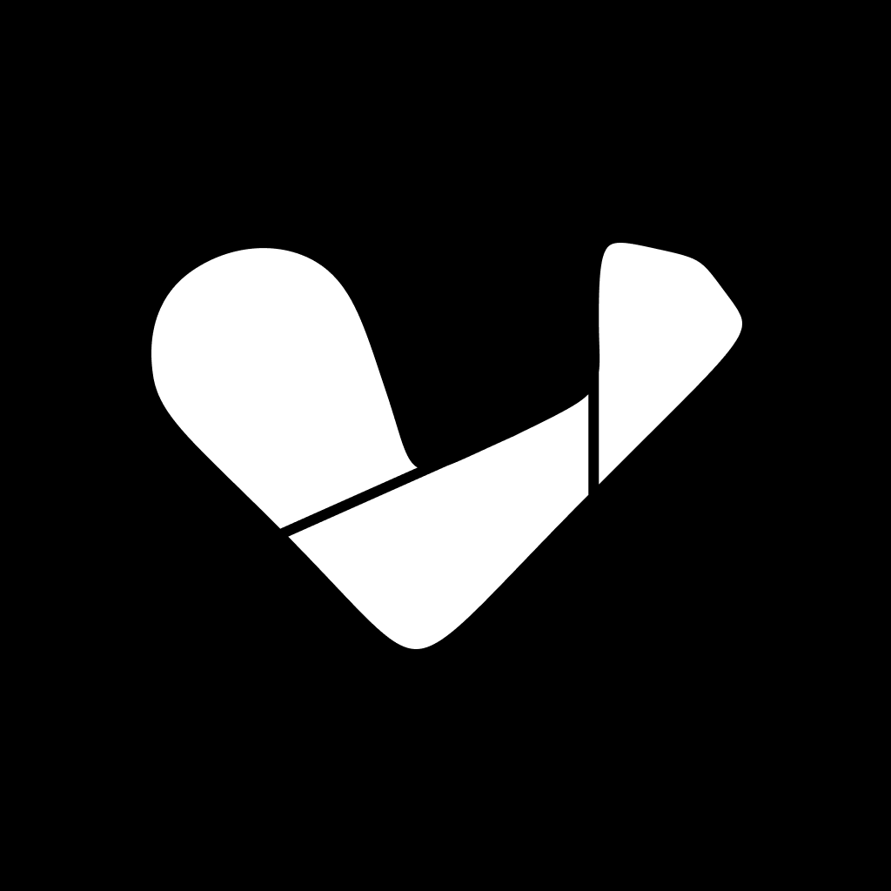

<a id="readme-top"></a>

<!-- PROJECT LOGO -->
<br />

<div align="center">
  <a href="https://github.com/FlexForge/flex_workout_mobile">
    
  </a>

<h3 align="center">Flex Workout App (MVP)</h3>

  <p align="center">
Flexible is a workout logging app designed to help beginner to advanced lifters get the most out of their workout.
    <br />
    <a href="https://github.com/FlexForge/flex_workout_mobile/issues/new?labels=bug&template=bug-report---.md">Report Bug</a>
    ·
    <a href="https://github.com/FlexForge/flex_workout_mobile/issues/new?labels=enhancement&template=feature-request---.md">Request Feature</a>
  </p>
</div>

[![Stargazers][stars-shield]][stars-url]
[![Issues][issues-shield]][issues-url]
[![MIT License][license-shield]][license-url]

<!-- TABLE OF CONTENTS -->
<details>
  <summary>Table of Contents</summary>
  <ol>
    <li>
      <a href="#about-the-project">About The Project</a>
      <ul>
        <li><a href="#built-with">Built With</a></li>
      </ul>
    </li>
    <li><a href="#features">Features</a></li>
    <li>
      <a href="#features">Features</a>
      <ul>
        <li><a href="#onboarding">Onboarding</a></li>
      </ul>
      <ul>
        <li><a href="#workout-tracking">Tracking</a></li>
      </ul>
      <ul>
        <li><a href="#history">History</a></li>
      </ul>
      <ul>
        <li><a href="#exercise-list-and-info">Exercise List and Info</a></li>
      </ul>
    </li>
    <li>
      <a href="#getting-started">Getting Started</a>
      <ul>
        <li><a href="#installation">Installation</a></li>
      </ul>
    </li>
    <li><a href="#roadmap">Roadmap</a></li>
    <li><a href="#license">License</a></li>
  </ol>
</details>


<!-- ABOUT THE PROJECT -->
## About The Project

[![Product Name Screen Shot][product-screenshot]](https://example.com)

Over the past year, I've developing a cross-platform workout tracker app inspired by the MacroFactors nutrition application.

The app is built using Flutter and ObjectBox for backend to allow cross platform access and to allow a local-first approach, ensuring data security and offline functionality. This is currently the fourth iteration of the application, as I look to refined the app’s backend architecture and frontend UI to provide both and excellent UX and DX.

### Built With

[![Flutter][flutter-shield]][flutter-url]
[![Dart][dart-shield]][dart-url]
[![Swift][swift-shield]][swift-url]
[![Kotlin][kotlin-shield]][kotlin-url]

<p align="right">(<a href="#readme-top">back to top</a>)</p>

## Features

The MVP is currently very bare bones only containing a few features that are core to the user experience

### Onboarding

*The current onboarding experience is a placeholder acting as a user registration form until a more concrete registration process is required.*

https://github.com/user-attachments/assets/32322b09-c294-449d-a089-52062d4b7fdc

### Workout Tracking

![Workout Tracking Shot][workout-tracker]

https://github.com/user-attachments/assets/cc4507a9-4dc8-4ea7-96f7-63c1aab2ac25


### History

https://github.com/user-attachments/assets/847aa68f-531c-4bbf-9ab5-f5740fb37cee

### Exercise List and Info

![Exercises][exercises]

https://github.com/user-attachments/assets/4614d7ba-218a-4eba-b474-cb8e93952095

<!-- Exercises Mov -->

<p align="right">(<a href="#readme-top">back to top</a>)</p>

<!-- GETTING STARTED -->
## Getting Started

This is an example of how you may give instructions on setting up your project locally.
To get a local copy up and running follow these simple example steps.

### Installation

1. Clone the repo
   ```sh
   git clone https://github.com/FlexForge/flex_workout_mobile.git
   ```
2. Install the flutter packages
   ```sh
   flutter pub get
   ```
3. Run the build_runner to generate helper files
   ```sh
   dart run build_runner build
   ```
4. Run the project
   ```sh
   flutter run
   ```

<p align="right">(<a href="#readme-top">back to top</a>)</p>

<!-- ROADMAP -->
## Roadmap

- [ ] Rest Timer
- [ ] Templates
  - [ ] Template Workouts
  - [ ] Template Programs
- [ ] Online sync
- [ ] Data and Analytics (graphs - charts - summaries)

<p align="right">(<a href="#readme-top">back to top</a>)</p>

<!-- LICENSE -->
## License

Distributed under the MIT License. See `LICENSE.txt` for more information.

<p align="right">(<a href="#readme-top">back to top</a>)</p>


<!-- MARKDOWN LINKS & IMAGES -->
[stars-shield]: https://img.shields.io/github/stars/FlexForge/flex_workout_mobile.svg?style=for-the-badge
[stars-url]: https://github.com/FlexForge/flex_workout_mobile/stargazers
[issues-shield]: https://img.shields.io/github/issues/FlexForge/flex_workout_mobile.svg?style=for-the-badge
[issues-url]: https://github.com/FlexForge/flex_workout_mobile/issues
[license-shield]: https://img.shields.io/github/license/FlexForge/flex_workout_mobile.svg?style=for-the-badge
[license-url]: https://github.com/FlexForge/flex_workout_mobile/blob/master/LICENSE.txt
[product-screenshot]: assets/readme/flex.png
[workout-tracker]: assets/readme/tracking.png
[exercises]: assets/readme/exercises.png
[flutter-shield]: https://img.shields.io/badge/Flutter-%2302569B.svg?style=for-the-badge&logo=Flutter&logoColor=white
[flutter-url]: https://flutter.dev/
[dart-shield]: https://img.shields.io/badge/dart-%230175C2.svg?style=for-the-badge&logo=dart&logoColor=white
[dart-url]: https://dart.dev/
[swift-shield]: https://img.shields.io/badge/swift-F54A2A?style=for-the-badge&logo=swift&logoColor=white
[swift-url]: https://developer.apple.com/swift/
[kotlin-shield]: https://img.shields.io/badge/kotlin-%237F52FF.svg?style=for-the-badge&logo=kotlin&logoColor=white
[kotlin-url]: https://kotlinlang.org/


